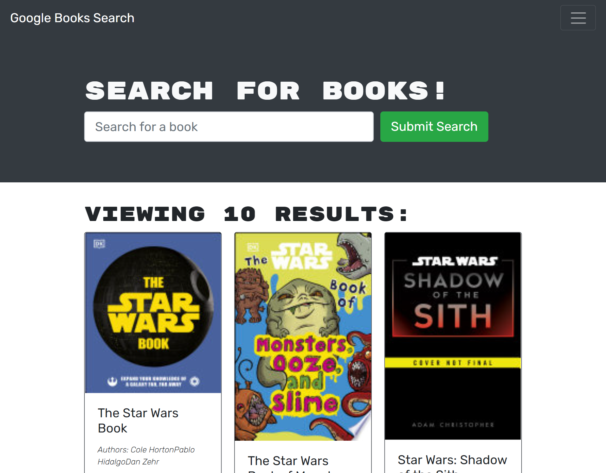

# book-search-engine

## Description 
  This application allows users/visitors to search for books. Logged in users are able to save books to their list as well as removed them. When a book is searched then a picture, author, and a description of the book is displayed to the user.Some of the technologies used for this project were GraphQL, JS, Apollo Server, MongoDB, Node, and express.

   A screenshot of the deployed application is attached below.

   This application can be found at the following link.
   
   LINK HERE

  
  ## Table of Contents
  - [Description](#description)
  - [Installation](#installation)
  - [Usage](#usage)
  - [License](#license)
  - [Questions](#questions)

  ## Installation 
  - Use a Termal or GitBash
  - Install graphql
    - npm install --save graphql
  - Install apollo-server
    - npm install apollo-server
  - Install express
    - npm install express
  - Use any compatible text editor
  - Clone or fork this repository to desired workstation

  ## Usage 
  Start the application by calling the file npm run develop in either Terminal or GitBash. Then the user can either login or signup. Once that is completed then the user can search for books and save or removed any books from their book list. 
 
  
  
  
  ## License
  - This project is under the [MIT](https://opensource.org/licenses/MIT) license. 

  ## Questions
  - Feel free to reach me via GitHub or Email with any questions regarding this project
  - GitHub: [georgedmendoza](https://github.com/georgedmendoza)
  - Email: [georgedmendoza13@gmail.com](mailto:georgedmendoza13@gmail.com)